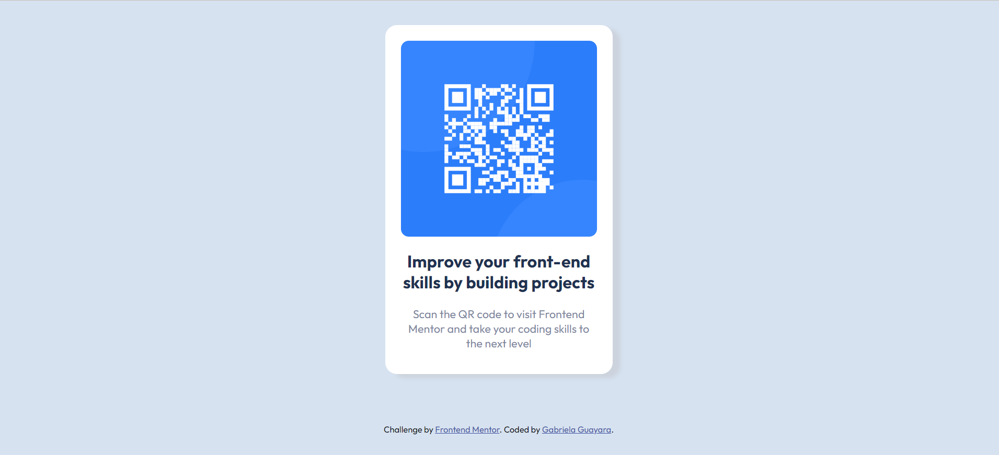

# Frontend Mentor - QR code component solution

This is a solution to the [QR code component challenge on Frontend Mentor](https://www.frontendmentor.io/challenges/qr-code-component-iux_sIO_H). Frontend Mentor challenges help you improve your coding skills by building realistic projects. 

## Table of contents

- [Overview](#overview)
  - [Screenshot](#screenshot)
  - [Links](#links)
- [My process](#my-process)
  - [Built with](#built-with)
  - [What I learned](#what-i-learned)
- [Author](#author)

## Overview

### Screenshot



### Links

- Solution URL: [Solution URL](https://github.com/GabrielaGuayara/qrCodeChallenge)
- Live Site URL: [Website URL](https://qrchallenge-gabrielaguayara.netlify.app/)

## My process

### Built with

- Semantic HTML5 markup
- CSS custom properties
- Flexbox


### What I learned

I learned how to embeded font-styles from Google fonts. 

```css
@import url('https://fonts.googleapis.com/css2?family=Outfit:wght@100..900&display=swap');

body{

  font-family: "Outfit", sans-serif;

}
```

## Author
Gabriela Guayara
- Website - [QR Code Challenge](https://qrchallenge-gabrielaguayara.netlify.app/)

